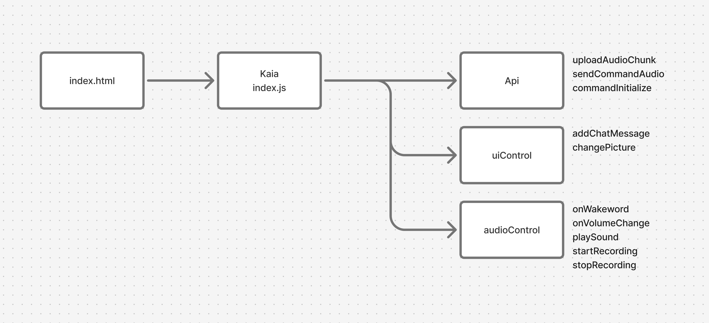

# Kaia frontend

This is a very simple web based frontend client for [Kaia](https://github.com/okulovsky/kaia) – kitchen ai assistant – think of it as cooler open source Alexa 

it can answer your queries, set timers, and help you live a more healthy and wholesome life


## Running the app Locally

1. You should have `NodeJS` 20+ installed. I recommend using `nvm` to manage NodeJS versions

2. Install js dependencies:
```
npm install
```

3. You should have **Kaia server** and **Kaia audio control** running on your local network, check out [Kaia](https://github.com/okulovsky/kaia) for installation guides

4. [Generate](https://github.com/FiloSottile/mkcert) local development certificates for https

5. Copy .env.example to .env and fill the file:

```shell
cp .env.example .env
```

6. Start js frontend:
```
npm run dev
```

7. Check out stdout and scan QR code / open the link. Grant microphone rights and say the wakeword. You are all set!

# Development

This project intentionally does not use React or any other frontend libraries



## Linting

The project uses ESLint. To run the linter:
```
npm run lint
```

## Wakeword detection:

This package uses vosk offline speech recognition. 

- documentation: [text](https://github.com/solyarisoftware/voskJs)
- download more models: [text](https://alphacephei.com/vosk/models)
